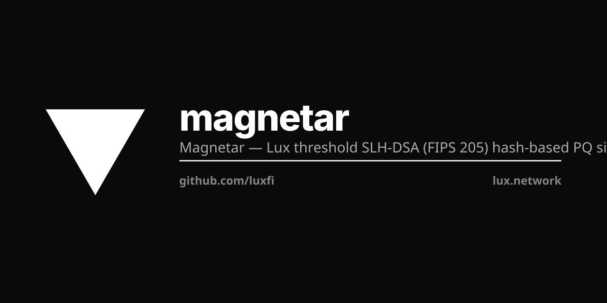

<p align="center"></p>

# Magnetar --- SLH-DSA (FIPS 205) for Lux

Magnetar is the hash-based PQ leg. SLH-DSA has no aggregatable
structure, so the SOUND production primitive is per-validator
standalone (N independent signatures); the threshold variants either
relocate trust into attested hardware (TEE pool) or are research-grade
(permissionless THBS-SE, which reconstructs the master at the public
combiner).

| Regime | Construction | Posture | Where |
|---|---|---|---|
| **Public-BFT consensus (DEFAULT, production)** | **Per-validator standalone** --- each validator holds its own FIPS 205 keypair, signs independently, consensus collects N signatures into a `ValidatorAggregateCert` | SOUND. No DKG, no dealer, no reconstruction. | `standalone.go` |
| **Trusted-hardware / custody (opt-in, production)** | **TEE-attested combiner pool** | SOUND under an honest trust model: the seed is reconstructed inside a measured enclave on t hosts that must agree --- trust-relocation (adds a host to the TCB), NOT MPC. | `luxfi/threshold/protocols/slhdsa-tee` |
| **Permissionless t-of-n threshold** | **THBS-SE** --- t-of-n committee, slot-bound commit-and-reveal, anyone-can-combine public combiner | RESEARCH-ONLY. The public combiner RECONSTRUCTS the full FIPS 205 master every signature (`ASSEMBLE-INVARIANT.md`). NOT no-leak. | `thbsse.go`, `thbsse_field.go`, `thbsse_assemble.go`, `slhdsa_internal.go` |

All three produce FIPS 205 wire bytes that an unmodified verifier
accepts. That is a correctness/interop property; it says nothing about
confidentiality. See `BLOCKERS.md` for the sound/open/falsely-closed
breakdown.

## Per-validator standalone (public-BFT primary)

```go
sk, pk, _ := magnetar.PerValidatorKeypair(params, rng)
sig, _    := magnetar.ValidatorSign(sk, rng, message)
// ... collected at the consensus layer ...
cert, _   := magnetar.BuildAggregateCert(params, signers, pubkeys, sigs)
valid, _  := magnetar.VerifyAggregateCert(cert, message, knownValidators)
```

No DKG, no shared seed, no aggregator-in-TCB. Wire size grows
linearly with the quorum (`N x |sigma|`). The Z-Chain Groth16 rollup
compresses the cert to ~192 bytes for long-term storage; the rollup
is a separate primitive (lux-zchain spec).

## THBS-SE (permissionless threshold)

```go
key, _   := magnetar.NewThbsSeKey(params, t, committee, setupRng)
// Per-party Round-1 / Round-2 over the slot binding ...
r1i, r2i, _ := magnetar.ThbsSeRound1(params, key.Shares[i], binding, msg, guard, rng)
// ... any peer (the "public combiner") collects t valid r1/r2 pairs ...
sig, ev, _  := magnetar.Combine(magnetar.ThbsSeCombineInput{
    Key: key, Binding: binding, Message: msg, Round1: r1s, Round2: r2s,
})
// sig.Bytes is canonical FIPS 205; verifies under unmodified circl.slhdsa.Verify.
```

### Setup --- two equivalent paths

**Dealer setup (KAT-reproducible).** `NewThbsSeKey` samples a master,
byte-shares it via Shamir over GF(257), and zeroizes the master
before return. The dealer machine is in the TCB FOR SETUP ONLY; once
the function returns, no party (including the dealer) holds the
master. Recommended for foundation-HSM single-host bootstrap and
KAT replay.

**Dealerless PVSS-DKG setup (`RunDKG`).** Each committee party runs
`NewPVSSPartyState` independently, publishes a `PublicContribution`
(per-coefficient hash commitments only), and distributes private share
rows over authenticated channels. The PRODUCTION path (`RunDKG`)
publishes NO constant-term reveals, so the master is not
reconstructible from the transcript. Any third party collates the
public payloads into a `PVSSTranscript` and invokes
`NewThbsSeKeyFromDealerlessDKG` to assemble the canonical `ThbsSeKey`.
(A separate `RunDKGSimulationOpenRevealTestOnly`, gated behind an
explicit hazard ack, runs the leaking open-reveal mode for KAT replay
only.):

```go
// Each party i runs in its own process.
state_i, _ := magnetar.NewPVSSPartyState(params, t, committee, uint32(i+1), rng)
contrib_i  := state_i.PublicContribution()  // broadcast publicly
share_to_j, _ := state_i.ShareTo(uint32(j+1))  // send privately to j
reveal_i := state_i.RevealMsg()              // broadcast publicly at Round 2

// Any auditor (or any party) collates the public-form transcript
// and assembles the canonical ThbsSeKey.
transcript := &magnetar.PVSSTranscript{
    Params: params, Committee: committee, Threshold: t,
    Contributions: contribs, Reveals: reveals,
    ReceivedShares: receivedShares, SetupTr: setupTr,
}
key, _ := magnetar.NewThbsSeKeyFromDealerlessDKG(transcript)
// key is byte-shape identical to the dealer-path output for the
// implicit master M = sum_{i in Q} m_i mod 257 byte-wise.
```

**What the production dealerless path guarantees (and what it does
not).** The `RunDKG` transcript carries no constant-term reveals, so
the master is not reconstructible from the transcript by observers.
It does NOT make "no party ever holds the master" true: deriving the
group public key needs `pk = SLH-DSA.PK(M)` (a hash tree over M), so
`deriveDKGPublicKey` reconstructs M transiently at whoever derives pk
and zeroizes it. That reconstruction is inherent (TEE/MPC only avoid
it). Naming the buffer `lagrangeScratch` is not a security property.
See `BLOCKERS.md` (P2) and `RunDKG`'s HONEST LIMITATIONS in
`pvss_dkg.go`. The production path also does NOT robustly exclude
malicious dealers at DKG time (hash commitments aren't openable
without revealing m_i); malformed shares are caught at sign time.

`RunDKGSimulationOpenRevealTestOnly` runs the full n-party protocol in
one process in open-reveal mode for KAT replay only; it requires an
explicit hazard ack and its transcript REVEALS the master.

**THBS-SE reveal discipline.** A revealed value is the per-round mask
`r_i`, the masked share `s'_i = share_i XOR r_i`, the public commit
hash, and the final signature. The share envelope is per-slot and the
slot guard refuses same-slot re-emission.

**The public combiner reconstructs the master.** Any peer can run
Combine (it is a pure function of public inputs), but it RECONSTRUCTS
the full FIPS 205 master into `derivedMaterial` to produce the
signature (`ASSEMBLE-INVARIANT.md`). So there IS effectively a host in
the TCB at sign time: whoever runs Combine sees the seed. This is why
the permissionless THBS-SE path is research-grade. The earlier claim
that the "strict-atom Combine closed the transient-seed gap" was proof
by rename (it avoids the variable name `seed`, not the reconstruction);
see `BLOCKERS.md::MAGNETAR-STRICT-ATOM` (OPEN).

**Slot binding**: every signature is bound to
`(chain_id, epoch, slot, height, committee_id, message_domain)`. The
binding flows into the cSHAKE256 commit transcript AND into the FIPS
205 ctx string at sign time, so a verifier holding the slot tuple
derives ctx independently and routes through unmodified
`slhdsa.Verify`.

**Slashing evidence**: a party that signs two distinct messages at
the same slot emits a `ThbsSeEquivocationError` carrying a wire-
shaped `ThbsSeEvidence` blob that any third party can verify via
`VerifyThbsSeEvidence` --- pure function, no committee state
required. Malformed shares produce typed `ThbsSeShareEvidence` blobs
verified via `VerifyThbsSeShareEvidence`.

**Over-selected committee**: with `(n, t)` and `n > t`, up to `n - t`
silent withholders are tolerated. Any t valid Round-2 reveals produce
byte-equal final signatures.

## Why per-validator standalone is the public-BFT default

SLH-DSA is hash-based; it has no algebraic structure that admits
FROST-style linear share-aggregation. The literature confirms:

- Cozzo and Smart, EUROCRYPT 2019 *Sharing the LUOV*: every internal
  SHAKE/SHA-2 evaluation in an HBS scheme is a non-linear function
  of the secret seed.
- Bonte, Smart and Tan 2023 *Threshold SPHINCS+*: exhaustive
  infeasibility analysis. There is no efficient t-of-n SLH-DSA
  scheme producing a single FIPS 205-shaped signature without either
  (a) reconstructing the seed in some combiner process or (b) running
  full MPC over the SHA-256/SHAKE hash tree (multi-second per
  signature, multi-megabyte of comms).

THBS-SE chooses (a) with a PUBLIC COMBINER. "Anyone can combine", but
whoever does RECONSTRUCTS the seed --- so the combiner IS effectively a
host in the TCB at sign time, which is why THBS-SE is research-grade,
not production. The TEE pool chooses (a) inside attested hardware
(trust-relocated, not removed). The per-validator standalone path
sidesteps (a) and (b) entirely by emitting N independent signatures and
is the production default.

## Status

| Field | Value |
|---|---|
| Standard | FIPS 205 SLH-DSA |
| Production primitive | Per-validator standalone (`standalone.go`) --- SOUND |
| Opt-in production | TEE-attested combiner pool (`luxfi/threshold/protocols/slhdsa-tee`) --- sound under attested-hardware trust |
| Research-only | THBS-SE permissionless threshold --- reconstructs the master at the public combiner |
| Reference implementation | `ref/go/pkg/magnetar/` --- pure Go, depends on `cloudflare/circl/sign/slhdsa` v1.6.3 |
| KAT vectors | `vectors/{keygen,sign,verify,thbsse-sign}.json` (deterministic regeneration) |
| Wire identity | All paths emit byte-identical FIPS 205 signatures; any unmodified slhdsa verifier accepts. Interop only --- not a confidentiality claim. |
| Cert-profile role | Polaris profile in `luxfi/quasar` (hash-based leg of the cross-family PQ profile) |
| Sibling primitives | Pulsar (FIPS 204 M-LWE), Corona (R-LWE) --- algorithmically distinct families |

## Headline tests

```bash
cd ref/go && GOWORK=off go test -count=1 -short -timeout 600s ./pkg/magnetar/...
```

- `TestMagnetar_Wire_FIPS205Verifiable` (wire_test.go) --- pins
  byte-identity between `ValidatorSign` output and unmodified
  `cloudflare/circl/sign/slhdsa.Verify` across all 3 SHAKE modes.
- `TestThbsSE_Wire_FIPS205Verifiable` (thbsse_test.go) --- pins the
  same identity for the THBS-SE public combiner output.
- `TestThbsSE_RejectSeedReveal`,
  `TestThbsSE_RejectOversizedShareWireSize`,
  `TestThbsSE_RejectTamperedShareCommitMismatch`,
  `TestThbsSE_SlotReuseRejected`, `TestThbsSE_OverselectedCommittee`,
  `TestThbsSE_SlotBindingDomainSeparation` --- the THBS-SE
  commit-binding / slot-binding gates. (The last two reject-tests were
  formerly mis-named ...UnselectedFORS / ...WOTS; THBS-SE shares the
  whole seed, so they test commit binding, not atom selection.)
- `TestPVSS_DKG_ProductionTranscriptHidesMaster` --- the production
  `RunDKG` transcript hides the master (P2 leak-fix regression gate);
  the open-reveal path reveals it (contrast).
- `TestPVSS_DKG_ByteCompatWithDealerPath`,
  `TestPVSS_DKG_AdversarialReveals`,
  `TestPVSS_DKG_RobustnessAgainstMaliciousCommitments`,
  `TestPVSS_DKG_EndToEnd_SignAndVerify` --- further DKG gates
  (the end-to-end test drives the production `RunDKG` path).
- `BenchmarkThbsSE_Sign_5of7/Magnetar-SHAKE-192f` --- end-to-end
  per-signature wall-clock at < 100 ms/op on Apple M1.
- `TestKAT_ThbsSe` --- deterministic vector replay at (n=7, t=4) x 3
  modes x 3 messages.

## Operator-controlled MPC custody

For deployments where an HSM-attested host is in the TCB by
deployment policy (e.g. M-Chain bridge custody, A-Chain confidential
compute), TEE-attestation-gated variants ship under
`luxfi/threshold/protocols/{slhdsa,mldsa,rlwe}-tee` via the
`lux/mpc` sibling tree --- NOT in this package. Magnetar's role is
the public-BFT and permissionless-threshold surface; the operator-
controlled variants are decomplected into their own primitive slot.

## Where this is used

The hash-based leg of the **Polaris** cert profile in
[`luxfi/quasar`](https://github.com/luxfi/quasar) --- the
maximum-assurance cross-family profile pairing lattice PQ (Pulsar
M-LWE + Corona R-LWE) with hash-based PQ (Magnetar SLH-DSA).

## Documents

- `SPEC.md` --- normative construction specification.
- `THBS-SPEC.md` --- THBS-SE normative spec (slot binding,
  commit-reveal, public-combiner, evidence).
- `CHANGELOG.md` --- release-by-release framing.
- `DEPLOYMENT-RUNBOOK.md` --- public-BFT default + the v1.0 honest
  open item (transient seed reconstruction at the public combiner).
- `BLOCKERS.md` --- sound / open / falsely-closed enumeration
  (THBS-SE reconstructs the master; PVSS-DKG leak fix; TEE trust model).
- `CRYPTOGRAPHER-SIGN-OFF.md` --- internal review (standalone only).
- `TRUSTED-COMPUTING-BASE.md` --- TCB enumeration.
- `PROOF-CLAIMS.md` --- per-property proven/asserted/open (no
  mechanized threshold proof exists).
- `AXIOM-INVENTORY.md` --- assumed-axiom enumeration.
- `FIPS-TRACEABILITY.md` --- line-by-line FIPS 205 conformance trace.
- `PATENTS.md` --- patent-status notes.
- `LICENSING.md` --- license terms.
- `SUBMISSION.md` / `NIST-SUBMISSION.md` / `SUBMISSION-STATUS.md` ---
  NIST MPTC submission framework.
- `AUDIT-2026-06.md` --- 2026-06 production-readiness audit
  (public-permissionless-chain safety, TEE integration story,
  GPU acceleration story, canonical-name positioning).
- `TEE-INTEGRATION.md` --- TEE-attested production surface spec
  (SEV-SNP today, TDX + NRAS post-#222, operator-side wiring).
- `GPU-PORT-PLAN.md` --- v1.3 GPU acceleration port plan (four
  batched FIPS 205 hash-tree kernels at
  `lux-private/gpu-kernels/ops/crypto/slhdsa/`).
- `SECURITY.md` --- threat model + strict-PQ profile.
- `ASSEMBLE-INVARIANT.md` --- what the THBS-SE Combine path actually
  does (it reconstructs the master; "strict-atom" was proof-by-rename).

## Build

```bash
cd ref/go && GOWORK=off go build ./...
cd ref/go && GOWORK=off go test -count=1 -short -timeout 600s ./pkg/magnetar/...
cd ref/go && GOWORK=off go test -count=1 -race -short -timeout 600s ./pkg/magnetar/...
```

## Citations

- NIST FIPS 205 (2024). *Stateless Hash-Based Digital Signature
  Standard.*
- Cozzo, D. and Smart, N. P. (2019). *Sharing the LUOV.* EUROCRYPT.
- Bonte, C., Smart, N. P. and Tan, T. (2023). *Threshold SPHINCS+:
  Practical Threshold Signatures from a Stateless Hash-Based
  Signature.*
- McGrew, D., Wallace, C. and Whyte, W. (2019). *Threshold Hash-Based
  Signatures.* IACR ePrint 2019/793.
- Schoenmakers, B. (1999). *A simple publicly verifiable secret
  sharing scheme and its application to electronic voting.* CRYPTO.
- Shamir, A. (1979). *How to share a secret.* Communications of the
  ACM.
